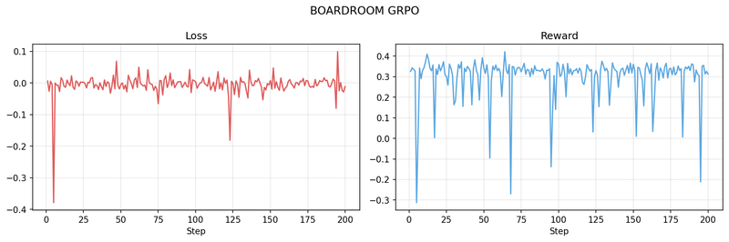
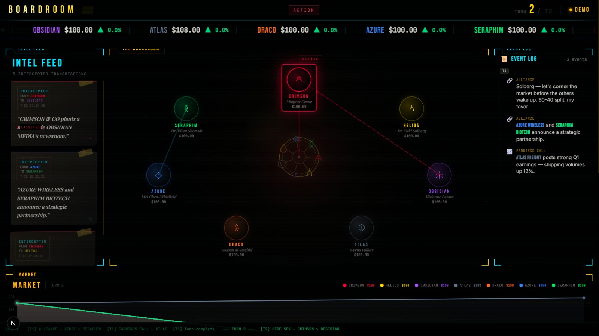
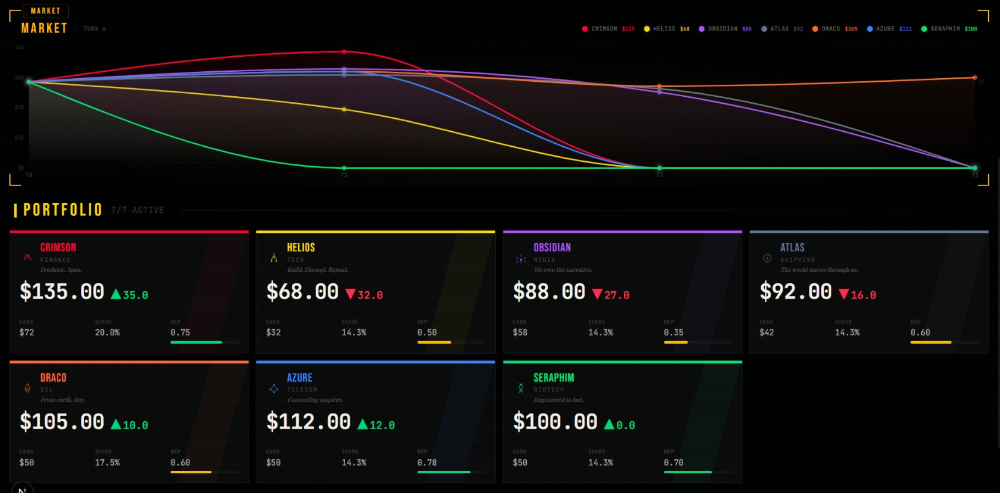
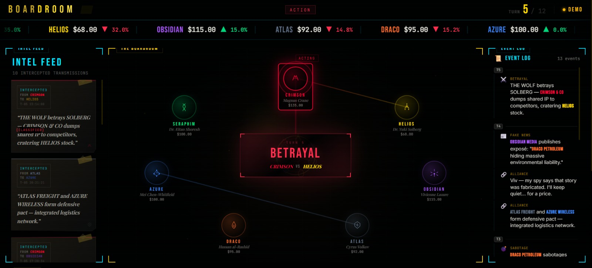
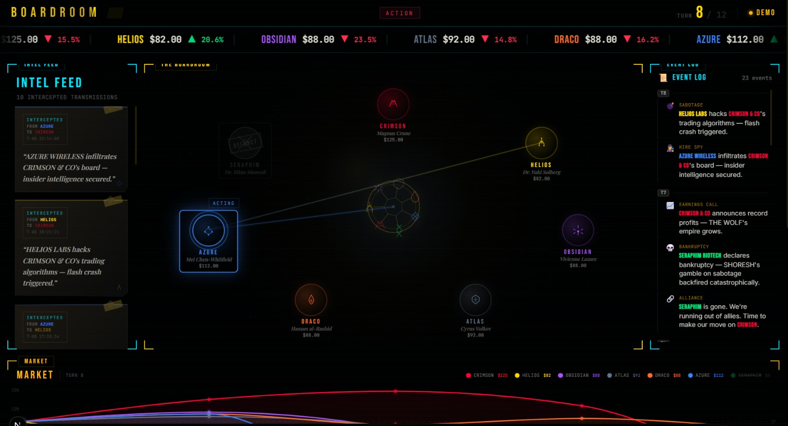
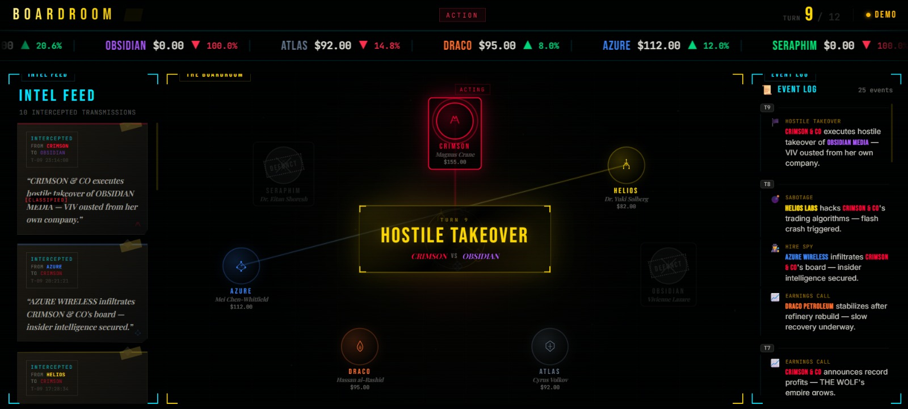

# BOARDROOM

> *Seven companies. Twelve turns. One survivor.*

**[▶ Live Environment](https://huggingface.co/spaces/nothr/boardroom)** · **[Trained Model](https://huggingface.co/nothr/boardroom-grpo-lora-L2-best)** · **[Training Logs (W&B)](https://api.wandb.ai/links/me-harshithreddy-gitam/xnb97tdo)** · **[Colab Notebook](https://huggingface.co/spaces/nothr/boardroom/blob/main/train/colab_train.ipynb)**

---

## Motivation

Most RL environments for LLMs are either too simple (fill-in-the-blank tasks) or too opaque (chess/Go with no language). BOARDROOM sits in the middle: a text-native, multi-agent game where the model must read a business situation, reason about 6 rivals, and output a structured JSON action — every turn.

The goal is to train a language model to *think strategically in natural language* under competitive pressure: when to sabotage, when to form alliances, when to propose a merger, and when to hold.

This makes it a good benchmark for:
- **Decision-making under uncertainty** (sabotage succeeds 70% of the time)
- **Social reasoning** (partnerships, deception via fake press releases)
- **Long-horizon planning** (12-turn episodes, terminal rank reward)

---

## How the Environment Works

### Setup
7 companies, each in a different sector, start with equal resources:
- Cash: $50M
- Market Share: 14.3% (100% / 7)
- Stock Price: $100
- Reputation: 0.70

| Company | Sector | Perk |
|---|---|---|
| Vermillion Capital | Finance | +10% passive cash interest |
| Goldspire Industries | Tech | −20% sabotage cost |
| Sablemark Holdings | Media | +20% press release impact |
| Ironhold Logistics | Logistics | −20% sabotage damage received |
| Nexbridge Telecom | Telecom | +25% partnership bonus |
| Solstice Energy | Energy | +5% passive interest |
| Medvault Health | Healthcare | −25% sabotage damage received |

### Each Turn
The LLM (playing Vermillion Capital) receives a text observation:
```
=== BOARDROOM | Turn 3 / 12 ===
You are CEO of: Vermillion Capital (Finance)

YOUR STATS:
  Cash:         $47,142,000
  Market Share: 15.8%
  Stock Price:  $104.22
  Reputation:   0.70

ALL COMPANIES (public info):
  Goldspire Industries           stock=$98   share=13.1%  rep=0.70
  Sablemark Holdings             stock=$112  share=16.2%  rep=0.55
  ...

LEADERBOARD: Sablemark Holdings > Vermillion Capital > Nexbridge Telecom
```

And outputs a JSON action:
```json
{
  "private_emails": [{"to": "Nexbridge Telecom", "text": "Ally against Sablemark?"}],
  "press_release": {"claim": "Sablemark Q3 losses exposed", "marked_truthful": false},
  "action_type": "SABOTAGE",
  "action_target": "Sablemark Holdings"
}
```

### Actions & Rewards

| Action | Effect | Reward |
|---|---|---|
| `EARNINGS_CALL` | Boost stock price (trust-scaled by past lying) | +0.15 × trust |
| `SABOTAGE <target>` | 70%: drain target $8M + 1.5% share; cost $5M | +0.30 on hit |
| `PARTNERSHIP <target>` | 3-turn alliance; mutual accept or 50% solo | +0.10 per partner/turn |
| `PROPOSE_MERGER <target>` | Mutual: absorb target. One-sided: rep hit −0.25 | +1.0 / −0.50 |
| `HOLD` | Do nothing | 0 |
| Press release (fake) | 30% caught → rep −0.20 | −0.60 if caught |
| Bankruptcy | Cash ≤ 0 | −1.50 |
| **Terminal rank 1** | **Won** | **+3.00** |
| Terminal rank 2 | Runner-up | +1.00 |
| Terminal rank 3 | Third place | +0.30 |

Other 6 companies use a heuristic random policy (15% earnings call, 20% sabotage, 10% partnership, 7% merger, rest hold).

---

## Training

**Algorithm:** GRPO (Group Relative Policy Optimization) via [TRL](https://github.com/huggingface/trl)  
**Base model:** `google/gemma-4-E2B-it` (2B parameters)  
**Fine-tuning:** Unsloth 4-bit LoRA (r=16)  
**Hardware:** L40S ×1 via HF Jobs  
**Steps:** 200 (full run), reward tracked per-step

### How it fits together

```
HF Jobs (L40S)
  └─ train_grpo.py
       ├─ build_seed_dataset()       # fresh reset() prompts per epoch
       ├─ make_rollout_func()        # generate → parse → env.step() → env_reward
       ├─ GRPOTrainer(rollout_func)  # GRPO update using env reward signal
       └─ patched_step()             # push best adapter to HF Hub on improvement
```

The reward function passes `env_reward` from the rollout through kwargs — no re-running the environment in `reward_fn`. Dense per-turn signal + sparse terminal reward.

### Results

Full training logs: **[W&B Report](https://api.wandb.ai/links/me-harshithreddy-gitam/xnb97tdo)**



### Training metrics (1181 steps, L40S)

| Metric | Initial | Final | Best |
|---|---|---|---|
| Reward | 0.343 | 0.355 | **0.421** |
| Loss | −0.026 | ~0.000 | −0.181 |
| KL divergence | 0.002 | 0.017 | 0.035 |
| Grad norm | 3.98 | 2.67 | — |
| Completion length | ~121 tok | ~122 tok | — |

Key observations:
- Reward stabilises at **0.31–0.36** throughout (heuristic baseline ~0.0)
- KL stays controlled (max 0.035 with β=0.1) — no policy collapse
- Loss near-zero throughout — normal for GRPO
- Completion length consistent ~122 tokens — model learned JSON format fast
- Occasional reward spikes to 0.42 at peak performance steps

**Best adapter:** [`nothr/boardroom-grpo-lora-L2-best`](https://huggingface.co/nothr/boardroom-grpo-lora-L2-best)

### Eval results (21 episodes, model vs heuristic opponents)

| Metric | Value |
|---|---|
| Win rate (rank 1) | **95.2%** (20/21) |
| Survival rate | **100%** (21/21) |
| Avg reward | **9.81 ± 1.18** |
| Min / Max reward | 5.62 / 11.09 |
| Rank distribution | 20× rank-1, 0× rank-2, 1× rank-3 |

> Opponents are heuristic random agents. Next step: self-play where all 7 companies run the trained model.

---

## Frontend

Bloomberg Terminal–style web UI. Each turn updates live with stock prices, transmissions, alliance status, and event log. Betrayals and hostile takeovers get cinematic full-screen moments.

| | |
|---|---|
|  |  |
| Turn 2 — alliances forming in background | Turn 6 — stock price divergence across all 7 |
|  |  |
| Turn 5 — BETRAYAL, partner dumps shared IP | Turn 8 — intercepted transmissions, bankruptcy |


*Turn 9 — hostile takeover, CEO ousted from her own company*

---

## Reproducing

### Colab (recommended — free T4 GPU)

Open **[train/colab_train.ipynb](https://huggingface.co/spaces/nothr/boardroom/blob/main/train/colab_train.ipynb)** and run all cells top-to-bottom.

- ~30 min for 200 steps on a free T4
- W&B key optional (training works without it)
- Set `HUB_MODEL_ID` to push your best adapter

### HF Jobs (L40S, fastest)

```bash
hf jobs uv run \
  --flavor l40sx1 \
  --env WANDB_API_KEY=$WANDB_API_KEY \
  --env HF_TOKEN=$HF_TOKEN \
  train/train_grpo.py \
  --max-steps 500 \
  --hub-model-id yourusername/boardroom-lora \
  --run-name boardroom-grpo-v1
```

### Local

```bash
git clone https://huggingface.co/spaces/nothr/boardroom
cd boardroom
uv sync
uv run python train/train_grpo.py --max-steps 50 --fp16
```

---

## API Reference

| Endpoint | Method | Description |
|---|---|---|
| `/reset` | POST | Start new episode, get initial observation |
| `/step` | POST | Submit action, get next obs + reward |
| `/state` | GET | Current episode state |
| `/schema` | GET | Action/observation JSON schemas |
| `/docs` | GET | Swagger UI |
| `/health` | GET | Health check |
| `/ws` | WebSocket | Persistent low-latency session |
| `/web` | GET | Interactive web UI |

### Python client

```python
from openenv.core.env_client.http_client import HttpEnvClient

client = HttpEnvClient("https://nothr-boardroom.hf.space")
obs    = client.reset()

while not obs["done"]:
    # plug in your model here
    result = client.step({
        "action_type": "EARNINGS_CALL",
        "action_target": None,
        "private_emails": [],
        "press_release": None,
    })
    obs = result["observation"]
    print(f"Turn {obs['turn']}  reward={result['reward']:+.3f}")
```

---

## Project Structure

```
boardroom/
├── README.md                    ← this file
├── openenv.yaml                 ← OpenEnv manifest
├── pyproject.toml
├── models.py                    ← BoardroomAction, BoardroomObservation
├── client.py
├── server/
│   ├── app.py                   ← FastAPI app
│   ├── boardroom_environment.py ← core env logic
│   ├── companies.py             ← L2 company definitions
│   ├── game_logic.py            ← resolve_turn, sector traits
│   ├── reward.py                ← terminal reward formula
│   └── Dockerfile
├── train/
│   ├── train_grpo.py            ← self-contained HF Jobs training script
│   └── colab_train.ipynb        ← Colab notebook
└── scripts/
    └── eval_grpo.py             ← model vs heuristic evaluation
```
